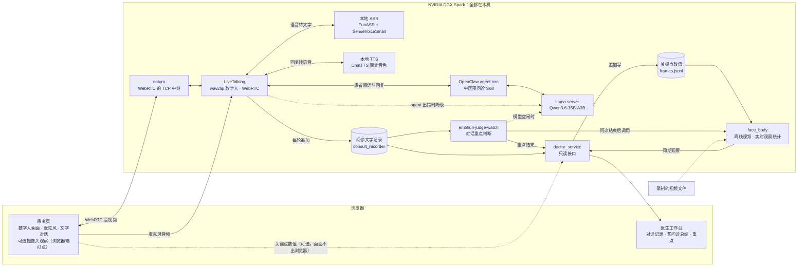

# Spark Hackson · 本地中医预问诊数字人

在一台 NVIDIA DGX Spark 上全本地运行的中医预问诊系统：患者与数字人语音对话完成就诊前信息采集，医生在工作台看到文字版对话、预问诊总结和值得先看的患者回答。

> **定位**：只做就诊前的信息采集与整理，**不诊断、不辨证、不开方**，不替代医生或急救。所有输出标注"待医生核实"。

参与开发请先读 [`AGENTS.md`](AGENTS.md) 与 [`docs/development.md`](docs/development.md)（分工、协作流程、项目文档）。

## 为什么做

- **固定表单不会追问**：传统预问诊多是固定表单，不随患者回答调整后续问题。本项目围绕主诉成组追问，已答的不重问。
- **医生开诊前需要一份可核对的记录**：系统把问诊整理成"医生参考版"和"患者核对版"，帮助医生更快掌握情况。
- **说话比填表容易**：语音 + 数字人形象降低填表门槛，也可随时改为打字。
- **问诊内容敏感，应留在本地**：语音识别、大模型、语音合成、数字人、问诊后分析全部在同一台 DGX Spark 上完成，默认不调用云端 API。

## 它能做什么

**患者端**（`apps/multimodal/web/triage.*`）

1. 点「开始问诊」，数字人先介绍身份和预问诊目的，随即开始采集；
2. 直接说话即可——页面自动断句，数字人说话时患者开口就能打断；也可以随时打字；
3. 按中医预问诊 Skill 的主线推进：基本信息与主诉 → 围绕主诉成组询问 → 一次补充机会 → 适用女性单独了解月经 → 吃饭、睡觉、大便、小便只补缺项 → 展示记录，由患者选择补充或结束；
4. 出现剧烈胸痛、卒中表现、呕血黑便、严重过敏等危险线索时，暂停常规问题，先提示联系急救或尽快急诊；
5. 结束后生成两版记录，患者页展示"患者核对版"，患者可提出更正；
6. **可选的摄像头观察**（默认关闭）：患者主动开启后，画面一角的小窗显示本人预览和面部打点、上身骨架，下方实时显示转头、眨眼、目光偏离等动作数值；每说完一句话，这句下面追加一行「本次回答观察」。画面只在浏览器里处理，只把关键点数值发给 Spark；不开摄像头时问诊流程完全不变。

**医生端**（`apps/multimodal/web/doctor.*` + `doctor_service.py`，只读）

1. 会话列表：`正在进行 / 已出总结 / 中断未结`，自动刷新，可搜索；
2. 「对话记录」：整场问诊的文字版全文，区分患者/助手、语音/文字输入；患者开了摄像头时，每条患者回答下附一行同期观察（相对本人基线的目光偏离、眨眼、手触脸、小动作，数据不足标 `unknown`；没开摄像头只在最前面说明一次）；
3. 「预问诊总结」：医生参考版，一键复制；患者核对版折叠在下方对照；
4. 「重点」：问诊结束后由本地大模型自动标出值得先看的患者回答，**风险线索永远排在最前**，点一条跳回对话原句，每条命中同样附同期观察；不给任何情绪标签。

**辅助观察**（`apps/emotion/`）

- **对话重点判断 `judge/`**：两组固定题目（情绪/沟通 6 题、医疗信息 6 题）让本地大模型逐条判断患者回答，答案是类型化的（布尔概率、带置信度的单选、0–9 评分），单选题都带 `unknown`。常驻服务在问诊结束后自动运行，结果供医生工作台「重点」页签读取。
- **面部与身体观察 `face_body/`**：用 MediaPipe 把一段视频变成按时间窗（默认 5 秒）的可观察量——头姿、相对本人基线的目光偏离、眨眼、面部动作单元（AU）的 blendshape 近似、肩倾、躯干前倾、手触脸比例、小动作量。某窗检出率低于 0.5 或检出帧不足 10 帧时该通道记为 `unknown`、不给数值；双肩不可见的帧不计入身体通道，过短的末窗并入前一窗。不做人脸识别，不做表情或情绪分类。既能离线处理视频文件，也用于实时问诊的摄像头观察：浏览器端打点（约 5 fps），问诊结束后由 `live.py` 按每条患者回答切段统计，不进 judge。

**阶段一（文字预问诊）现状**：`apps/text_triage/` 目前是预留目录，独立的问题树与规则模块尚未实现。文字预问诊由同一个 OpenClaw agent + 预问诊 Skill 承担——该 Skill 本身适用于文字、视频和语音交互，患者页也可全程打字。

## 系统架构



- **问诊大脑**：OpenClaw agent `tcm` 加载中医预问诊 Skill `tcm-preconsultation`（2.1.0），决定问什么、何时结束、怎么写记录。Skill 内容依据《中医诊断学》（中国中医药出版社，ISBN 9787513268493）第三章"问诊"，危险线索出口参考 NHS 公开的急症说明。agent 工作区快照见 [`apps/multimodal/deploy/openclaw/`](apps/multimodal/deploy/openclaw/README.md)。
- **本地大模型**：llama.cpp `llama-server` 运行 Qwen3.6-35B-A3B（GGUF，UD-Q4_K_XL 量化约 22 GB，同时加载 mmproj 视觉投影），64K 上下文，关闭思考链，只监听本机回环并用 API key 鉴权。默认开启 DFlash 草稿模型投机解码（与演示机一致）；草稿模型文件不存在时自动跳过。
- **会话与降级**：一个数字人会话对应一个 agent 会话，问诊状态跨轮累积；agent 出错时降级直连本地模型，再失败则说固定话术，不会静默无声。
- **网络**：部署机公网不放通 UDP，WebRTC 音视频全部经 coturn 的 TCP 通道中继。
- **一个模型两种用途**：实时问诊与问诊后的重点判断共用同一个 `llama-server`；judge 每次请求前先等模型空闲、数字人无在线会话，不和实时对话抢资源。

## 为什么是 DGX Spark

- **整条链路一台机器**：35B 大模型、OpenClaw agent、ASR、TTS、wav2lip 数字人、TURN 中继、医生工作台、judge、face_body 同机运行；链路不调用云端 API，模型权重全部落地，断网仍可完整工作。
- **统一内存装得下整套服务**：数字人 + 大模型 + TTS 合计需 ≥ 40 GB 显存/统一内存（模型约 22 GB、ChatTTS 约 3 GB，外加 wav2lip 缓冲）；模型全量驻留内存后，prefill 从 270 提升到 2074 tok/s。
- **aarch64 + CUDA 13 软件栈已跑通**：GB10 / Ubuntu 24.04、torch 2.9.1+cu130 aarch64 轮子、CUDA 版 llama.cpp、FunASR（aarch64 无匹配 torchaudio 轮子，改用 kaldi-native-fbank）、ChatTTS——踩过的坑都写进了部署文档。
- **敏感数据不出机器**：对医疗场景，这是能落地的前提。

## 关键数据

| 环节 | 数值 | 条件 | 来源 |
|---|---|---|---|
| agent 单轮回复（6 轮问诊） | 首轮 4.1 s；第 2–5 轮 0.70–0.94 s；生成记录轮 2.4 s；合计 9.9 s | GB10，OpenClaw agent + 本地 Qwen3.6 | [部署文档 §4](apps/multimodal/deploy/livetalking/README.md) |
| 语音优先规则 | 每轮回复 260–310 → 30–60 tokens，稳态延迟减半 | agent 规则：一轮一个核心问题 | 同上 §4 |
| 本地模型吞吐 | prefill 2074 tok/s（未全量驻留时 270）；生成 60–105 tok/s | `llama-server --load-mode none` | 同上 §4；`11_setup_local_llm.sh` |
| 本地 ASR | 5.4 s 中文语音转写与原文完全一致；稳态 0.10–0.16 s | SenseVoiceSmall，GPU | 部署文档 §8 |
| 本地 TTS | 15 字 0.88 s；38 字 2.5 s | ChatTTS；送 TTS 单段上限 12 字 | `deploy/livetalking/env.sh` |
| WebRTC over TCP | 浏览器侧候选为 relay 并连通，512×512 视频；TURN 10/10 报文、0 丢包 | coturn TCP 中继 | 部署文档 §5 |
| 重点判断（Spark） | precision 1.00 · recall 0.96 · 风险召回 3/3；5 段共 177 s | Qwen3.6-35B-A3B，5 段虚构对话 | [`judge/README.md`](apps/emotion/judge/README.md) |
| 重点判断（开发机） | precision 1.00 · recall 0.88 · 风险召回 3/3 | qwen3-vl:8b，RTX 5070，同一组 5 段 | 同上 |
| 面部与身体观察 | 约 9 帧/秒；人脸与姿态检出率 1.0 | Spark CPU，512×512 视频（5 s，125 帧） | [`face_body/README.md`](apps/emotion/face_body/README.md) |
| 摄像头观察（患者页） | 浏览器端约 5 fps 打点；每 2 秒上传一批关键点数值；画面不出浏览器 | MediaPipe Tasks Vision 网页版 1.0.1，患者电脑 CPU | [`face_body/README.md`](apps/emotion/face_body/README.md)「实时通道」 |
| 单元测试 | judge 89 个 + face_body 62 个（本机与 Spark 均已运行）；医生端接口 36 个、浏览器端指标 7 个（本机） | 不需要模型、不联网 | `pytest apps/emotion/*/tests`、`pytest apps/multimodal/deploy/livetalking/tests`、`node --test apps/multimodal/web/tests/camera-metrics.test.js` |

judge 的金标准由人工标注、待领域专家审阅，分数只用于比较题目与模型改动，不是临床指标。

## 医疗安全与隐私

- **只做预问诊**：不诊断、不辨证、不开方；患者页与医生工作台固定显示免责声明，记录一律标注"待医生核实"。
- **危险线索优先**：Skill 规定出现危险线索时先暂停常规问题、提示急救，再整理已有信息；未命中不能写"已排除危险"。judge 的风险线索只抬不压、永远置顶。独立于大模型的确定性红旗规则层已在 [`docs/safety-and-privacy.md`](docs/safety-and-privacy.md) 中设计，**尚未实现**——目前危险线索处理依赖 agent 遵循 Skill 规则。
- **本地优先**：推理全部在本机；模型、TTS、agent 网关只监听本机回环；问诊后的自动判断服务只用本地模型（judge 命令行的云端开关须显式开启，不用于真实问诊记录）。
- **数据最小化**：原始录音不落盘，只在内存中用于识别；问诊只保存文字记录，文件仅属主可读写，可整体关闭记录；摄像头观察默认关闭，画面不出浏览器，Spark 只存关键点数值；face_body 只输出数值、不存图像；agent 的问诊记录与记忆不进仓库。
- **情绪相关信号是不确定的辅助**：不出情绪标签、不做表情分类、不做人脸识别；观察数值只和本人基线比；检出不足标 `unknown`；judge 的百分比是模型自报置信度。
- **只用虚构数据**：仓库中的样本全部为编造，不含真实患者信息。

完整原则见 [`docs/safety-and-privacy.md`](docs/safety-and-privacy.md) 与 [`AGENTS.md`](AGENTS.md) §3。

## 仓库结构

```text
apps/
  multimodal/              阶段二：多模态数字人
    web/                   患者页 triage.* · 医生工作台 doctor.*
    deploy/livetalking/    编号部署脚本、LiveTalking 补丁、医生端服务、本地 TTS 服务
    deploy/openclaw/       OpenClaw agent 工作区快照（含中医预问诊 Skill）
  emotion/                 阶段三：辅助观察
    judge/                 问诊后对话重点判断（含 5 段虚构样本与评测）
    face_body/             面部与身体观察（MediaPipe；离线视频与实时摄像头观察）
    deploy/                阶段三部署脚本与 systemd 服务
    research/              调研笔记与决策记录
  text_triage/             阶段一：预留目录，尚未实现
packages/core/             跨阶段公共契约：预留
data/question_trees/       问题树数据：预留
docs/                      产品、架构原则、路线图、安全与隐私、开发协作
.github/                   Issue/PR 模板、CI、自动看板
```

## 部署

部署步骤以各自文档为准，这里不重复：

- **阶段二**（数字人、ASR、TTS、本地大模型、OpenClaw agent、TURN、医生工作台）：[`apps/multimodal/deploy/livetalking/README.md`](apps/multimodal/deploy/livetalking/README.md)——脚本按编号执行，全部幂等、每步带自测；
- **阶段三**（judge、face_body、问诊后自动判断服务）：[`apps/emotion/deploy/README.md`](apps/emotion/deploy/README.md)。

模型权重、密钥和机器相关配置不入库，由脚本在目标机器上下载或生成。

## 演示

- 演示视频：[待补：演示视频链接]
- 患者端截图：[待补：截图]
- 医生工作台截图：[待补：截图]
- 实机测试操作手册：[`docs/实机测试操作手册.md`](docs/实机测试操作手册.md)（经 SSH 隧道访问 Spark 上的真实系统：连接、患者端问诊、医生工作台、测试脚本与常见问题）

患者页与医生工作台都支持在地址后加 `?demo=1`，用示例数据离线预览，不连后端。

## 团队

先信Capital XianXin Capital

## 致谢

- 中医预问诊 Skill 由外部合作者提供：[待确认：Skill 作者署名]
- [LiveTalking](https://github.com/lipku/LiveTalking)：实时数字人与 WebRTC 框架；口型驱动使用 [Wav2Lip](https://github.com/Rudrabha/Wav2Lip)
- [llama.cpp](https://github.com/ggml-org/llama.cpp)：本地大模型推理
- [Qwen](https://github.com/QwenLM)：Qwen3.6-35B-A3B 模型（GGUF 量化版来自 Unsloth）
- [OpenClaw](https://github.com/openclaw/openclaw)：agent 运行时与 Gateway
- [FunASR](https://github.com/modelscope/FunASR) 与 [SenseVoice](https://github.com/FunAudioLLM/SenseVoice)：本地语音识别
- [ChatTTS](https://github.com/2noise/ChatTTS)：本地语音合成
- [MediaPipe](https://github.com/google-ai-edge/mediapipe)：面部与姿态关键点
- [coturn](https://github.com/coturn/coturn)：TURN 中继
- [Jev](https://github.com/rezoch340/jev-chat-JARVIS-windows)：judge 借鉴其"固定题目 + 类型化答案"的判断结构
- 《中医诊断学》（中国中医药出版社）：预问诊 Skill 的内容依据

## 免责声明

本项目是黑客松作品，不是医疗器械，未经临床验证。系统输出仅用于就诊前信息整理，不构成诊断、治疗或用药建议，不能替代医生面诊或急救服务。Skill 中的危险线索提示是最低限度提醒，不构成完整分诊。所有演示使用虚构数据。遇到紧急情况请立即联系当地急救服务。

## License

代码按 [Apache License 2.0](LICENSE) 开源。医疗内容与模型输出均不构成医疗建议。
