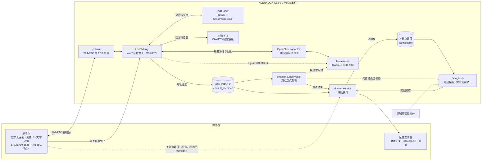

# Spark Hackson · 见到医生之前

在一台 NVIDIA DGX Spark 上全本地运行的中医预问诊系统：患者与数字人语音对话完成就诊前信息采集，医生在工作台看到文字版对话、预问诊总结和值得先看的患者回答。

> **定位**：只做就诊前的信息采集与整理，**不诊断、不辨证、不开方**，不替代医生或急救。所有输出标注"待医生核实"。

## 部署（从零开始）

本节面向拿到一台全新 NVIDIA DGX Spark、要从 `git clone` 开始完整重建整套系统的读者。仓库脚本都可以重复执行，每一步都带自检。各步骤的原理、全部参数和踩过的坑见 [阶段二部署文档](apps/multimodal/deploy/livetalking/README.md) 和 [阶段三部署文档](apps/emotion/deploy/README.md)。

### 1. 你需要准备什么

| 项 | 要求 |
|---|---|
| 硬件 | DGX Spark（GB10，统一内存）。运行时数字人、大模型和 TTS 合计需要 ≥ 40 GB 统一内存：模型约 22 GB，ChatTTS 约 3 GB，另加 wav2lip 缓冲 |
| 系统 | Ubuntu 24.04 aarch64，系统 Python 3.12（torch 轮子是 cp312），CUDA 13，`nvidia-smi` 正常。已验证的驱动版本是 580.82.09 |
| 系统工具 | `git curl jq docker python3-venv openssl cmake`、CUDA 工具链（`nvcc`，`11` 编译 llama-server 用）；`15` 要用 `npm`，装好 OpenClaw 后可直接借用它自带的 npm（见第 6 节） |
| 权限 | 仓库脚本全程不需要 sudo。需要 sudo 的只有两件事：用 apt 装上面的系统包；把当前用户加进 `docker` 组（`08` 用 docker 跑 coturn，要求不加 sudo 就能执行 `docker ps`） |
| 登录方式 | 用部署账号本人登录（SSH 或桌面）。`11`、`12` 和阶段三会创建 systemd **用户**服务（`systemctl --user`） |
| 浏览器 | 最新版 Chrome 或 Edge，带麦克风（建议戴耳机）；摄像头可选 |
| 总耗时 | 约 1.5–3.5 小时，大部分时间花在下载与编译上（大模型 20–60 分钟，torch 及其依赖 10–30 分钟，编译 llama-server 10–20 分钟） |
| 依赖版本 | 演示机各环境的实际版本：[`livetalking-venv`](apps/multimodal/deploy/livetalking/requirements/livetalking-venv.lock.txt)、[`tts-venv`](apps/multimodal/deploy/livetalking/requirements/tts-venv.lock.txt)、[`doctor-venv`](apps/multimodal/deploy/livetalking/requirements/doctor-venv.lock.txt)、[`emotion-venv`](apps/emotion/deploy/requirements-spark.lock.txt)（安装请用编号脚本，这些文件用于核对）；本机跑测试见 [`requirements-dev.txt`](requirements-dev.txt) |

**磁盘**：建议至少留出 60 GB 可用空间。下表是演示机实测占用：

| 内容 | 位置 | 大小 |
|---|---|---|
| Qwen3.6-35B-A3B（UD-Q4_K_XL）+ mmproj 视觉投影 | `~/models/Qwen3.6-35B-A3B-GGUF/` | 22 GB |
| DFlash 草稿模型（可选，不随仓库分发） | `~/models/Qwen3.6-DFlash/Qwen3.6-35B-A3B-DFlash-q8_0.gguf` | 421 MB |
| 预下载的轮子 | `~/torch-*.whl`、`~/wheels/` | 约 3 GB |
| 两个 GPU 环境（各自带 torch 和 nvidia 运行库） | `~/livetalking-venv`、`~/tts-venv` | 5.5 GB + 5.3 GB |
| ASR 模型（SenseVoiceSmall + FSMN-VAD） | ModelScope 缓存 | 0.9 GB |
| wav2lip 权重、ChatTTS 权重 | `~/LiveTalking/models/`、Hugging Face 缓存 | 205 MB + 1.7 GB |
| 阶段三环境、MediaPipe 模型、网页端打点资源 | `~/emotion-venv`、`~/emotion-models/`、`~/LiveTalking/web/vendor/` | 537 MB + 13 MB + 47 MB |
| 医生端环境、数字人形象 | `~/doctor-venv`、`~/LiveTalking/data/avatars/` | 29 MB + 每个形象 40–100 MB |

**网络**：默认配置按国内网络设计，镜像源直连，只有境外源走代理。

| 用途 | 访问的地址 | 相关变量 |
|---|---|---|
| 源码 | github.com：本仓库、LiveTalking；源码编译时还有 ggml-org/llama.cpp | `PROXY` |
| Python 包 | 阿里云 PyPI 镜像（直连）；`00b` 会查询 pypi.org 的 JSON 接口 | `PIP_MIRROR`、`PIP_TRUSTED` |
| torch 轮子 | download.pytorch.org（必须直连，走代理会返回 403） | `TORCH_INDEX` |
| 模型 | ModelScope：ASR 和 Qwen GGUF；hf-mirror.com：wav2lip 与 ChatTTS 权重；storage.googleapis.com：MediaPipe 模型（阶段三） | `HF_ENDPOINT`；阶段三的 `PROXY` |
| 容器镜像 | Docker Hub 上的 `coturn/coturn` | — |
| 网页端打点库 | registry.npmmirror.com，不通时改走 registry.npmjs.org | `CAM_NPM_REGISTRY`、`PROXY` |

`env.sh` 已经把国内镜像和 download.pytorch.org 写进 `NO_PROXY`。只有访问 GitHub、pypi.org 或 Hugging Face 需要代理时，才需要设置 `PROXY`（见第 3 节）。境外网络可以把 `PIP_MIRROR`、`PIP_TRUSTED`、`HF_ENDPOINT` 改回官方源。

### 2. 获取代码

```bash
git clone https://github.com/relativequntum/DGX-SPARK-HACKSON-HEALTH-AGENT-XIANXIN-CAPITAL.git ~/spark-Hackson
```

**建议克隆到 `~/spark-Hackson`**，原因有两个：阶段三的 `EMOTION_HOME` 默认就是这个目录；医生端读取「重点」结果的默认目录是 `~/spark-Hackson/outputs/judge/consult`。
如果克隆到别处，需要做两处设置：在 `~/.config/emotion/spark.local.env` 里写 `EMOTION_HOME=<克隆路径>`；在 `env.local.sh` 里写 `export DOCTOR_JUDGE_DIR=<克隆路径>/outputs/judge/consult`。

**脚本直接在仓库里运行**，不需要复制到别处。每个脚本启动时会先 `cd` 到自己所在的目录，并自动找到 `../../web`（页面）和 `../openclaw/workspace-tcm`（agent 工作区）。
演示机用的是平铺拷贝 `~/livetalking-deploy/`（包含 `web/` 和 `openclaw/workspace-tcm/`），这种布局脚本也支持，但推荐直接在仓库里运行。
无论哪种布局，脚本都会在 `$HOME` 下生成以下内容：

| 路径 | 内容 |
|---|---|
| `~/LiveTalking` | 上游数字人源码（会被打补丁） |
| `~/livetalking-venv`、`~/tts-venv`、`~/doctor-venv`、`~/emotion-venv` | 四个 Python 环境 |
| `~/livetalking-logs/` | 日志、pid 文件、问诊记录 `consultations/`、摄像头观察数值 `observations/` |
| `~/livetalking-deploy/` | TURN 配置与密钥、ChatTTS 固定音色、医生端服务与页面的副本 |
| `~/qwen36/`、`~/qwen-spark/secrets/`、`~/models/` | llama-server 的启动脚本和日志、API key、模型 |
| `~/.openclaw/`、`~/openclaw-spark/secrets/` | OpenClaw 配置、agent 工作区 `workspace-tcm`、gateway token |

**上游数字人源码**：固定到下面这个提交。补丁必须在 `07` 之前打，因为 `03` 的 `--session_timeout`、心跳接口 `/api/ping` 都来自这个补丁，`08` 的 `/api/turn` 路由也要挂在它后面：

```bash
git clone https://github.com/lipku/LiveTalking.git ~/LiveTalking
git -C ~/LiveTalking checkout b3e7490a20e7a6330492f8a6ea8200a5d50279d1
P=~/spark-Hackson/apps/multimodal/deploy/livetalking/patches/idle-session-reaper.patch
git -C ~/LiveTalking apply --check "$P" && git -C ~/LiveTalking apply "$P"
```

**数字人形象（必做）**：默认形象 `AVATAR_ID=wav2lip_nurse` 是演示机上的形象，不随仓库分发。以下两种方式任选一种，在 `02` 这一步传入：
- 使用官方示例形象：从 [LiveTalking](https://github.com/lipku/LiveTalking) README 给出的网盘地址下载 `wav2lip256_avatar1.tar.gz`，并在 `env.local.sh` 里把 `AVATAR_ID` 改成解压后的目录名；
- 用一段正面人脸视频生成：运行 `AVATAR_VIDEO=<视频.mp4>`，生成结果放在 `$AVATAR_ID` 目录下。

**OpenClaw（`12` 的前置条件，本仓库不负责安装）**：演示机用的是 OpenClaw 2026.9.5（自带 node v24.19.0，装在 `~/.openclaw/tools/` 下）。按 [OpenClaw](https://github.com/openclaw/openclaw) 官方说明安装，然后执行 `openclaw onboard`，生成 `~/.openclaw/openclaw.json`（gateway 认证方式用 token）。Gateway 需要以 systemd 用户服务 `openclaw-gateway` 运行，因为 `12` 是用 `systemctl --user restart openclaw-gateway` 重启它的。
**llama-server（`11` 的前置条件）**：演示机用 llama.cpp 官方 v0.4.1（提交 `b29c606e`）。`11` 在 `~/llama.cpp` 不存在时会克隆主线最新代码来编译，为了与演示机一致，先把 v0.4.1 克隆到这个位置，`11` 就会用它编译（`--spec-type draft-dflash`、`--load-mode none` 等参数需要这个版本）：

```bash
git clone --branch v0.4.1 --depth 1 https://github.com/ggml-org/llama.cpp ~/llama.cpp
```

如果只想让数字人能开口，不接 OpenClaw：在 `env.local.sh` 写 `LLM_PROVIDER=local`，就可以跳过 `12`，但这样不会加载中医预问诊 Skill。

### 3. 机器专属配置

所有脚本都通过 `source env.sh` 读取参数。本机专属的值写在同目录的 `env.local.sh` 里：这个文件已被 `.gitignore` 忽略，并且会先于 `env.sh` 的默认值加载。

```bash
# ~/spark-Hackson/apps/multimodal/deploy/livetalking/env.local.sh
# 写法与 env.sh 一致；用 := 写的值，仍可被命令行临时传入的同名变量覆盖

# 必填：08 会把它写进 coturn 的 realm。填浏览器访问本机用的域名；只经 SSH 隧道或在本机浏览器访问时，填任意固定字符串即可
: "${TURN_REALM:=spark.local}"

# 建议：服务端 ICE 候选只用默认路由出口的 IP，与 08 给 coturn 选的地址一致。
# env.sh 默认取 `hostname -I` 的第一个地址，可能取到高速网卡或 docker0，导致数字人连不上
: "${ICE_HOST:=$(ip route get 1.1.1.1 | awk '{for (i=1;i<=NF;i++) if ($i=="src") print $(i+1)}' | head -1)}"

# 数字人形象的目录名（用官方示例形象时改成解压后的目录名）
: "${AVATAR_ID:=wav2lip256_avatar1}"

# 可选：访问 GitHub / pypi.org / Hugging Face 需要代理时
# : "${PROXY:=http://<代理地址>:<端口>}"
# 可选：境外网络改回官方源
# : "${PIP_MIRROR:=https://pypi.org/simple/}"; : "${PIP_TRUSTED:=pypi.org}"; : "${HF_ENDPOINT:=https://huggingface.co}"
# 可选：没有 DFlash 草稿模型时显式关掉（不写也可以，11 只会告警并跳过）
# LLM_DRAFT_FILE=
```

阶段三只在需要代理，或者克隆位置不是 `~/spark-Hackson` 时，才需要 `~/.config/emotion/spark.local.env`。这个文件每行写一个普通赋值，例如 `PROXY=http://<代理地址>:<端口>`。

默认端口：

| 端口 | 服务 | 监听地址 |
|---|---|---|
| 8010 | LiveTalking：页面、信令、`/api/asr`、`/api/turn` | `0.0.0.0` |
| 3478/TCP | coturn（TURN 中继） | 主网卡 IP 与 `127.0.0.1` |
| 8110 | 医生端 `doctor_service`（页面、只读接口、摄像头观察上传） | `0.0.0.0` |
| 8020 | 阶段三输出浏览 | `127.0.0.1` |
| 8080 / 8090 / 18789 | llama-server / ChatTTS / OpenClaw Gateway | 只在本机回环，不要对外放通 |

`env.sh` 里的其他默认值，例如 `MAX_SESSION=16`、`SESSION_TIMEOUT=120`、`LLM_PROVIDER=openclaw`、`DOCTOR_RECORD_DIR`、`DOCTOR_OBS_DIR`，见 [部署文档第 2 节](apps/multimodal/deploy/livetalking/README.md)。`DOCTOR_OBS_DIR` 必须和阶段三的 `EMOTION_OBS_DIR` 相同，两者默认值已经一致。

### 4. 阶段二：按编号执行

```bash
cd ~/spark-Hackson/apps/multimodal/deploy/livetalking

bash 00_fetch_torch.sh                  # ① 预下载大轮子（这是实测走通的路径，推荐执行）
bash 00b_fetch_nvidia.sh
python3 -m venv ~/livetalking-venv      #    00c 要用这个环境里的 pip 解析依赖
bash 00c_fetch_reqs.sh
bash 01_setup_venv.sh                   # ② 数字人 Python 环境
AVATAR_TARBALL=<路径>/wav2lip256_avatar1.tar.gz bash 02_fetch_models.sh   # ③ 权重、ASR 模型、形象（也可用 AVATAR_VIDEO=<视频.mp4>）
bash 06_setup_local_tts.sh              # ④ 本地 TTS
bash 07_patch_livetalking.sh            # ⑤ LiveTalking 补丁
bash 11_setup_local_llm.sh              # ⑥ 本地大模型
bash 12_setup_openclaw.sh               # ⑦ OpenClaw agent（需要先装好 OpenClaw）
bash 03_run.sh                          # ⑧ 启动数字人；约 30 秒后再跑下面的自检
bash 04_smoke_test.sh; bash 05_asr_smoke_test.sh; bash 10_llm_smoke_test.sh
bash 08_setup_turn.sh                   # ⑨ TURN over TCP（经 SSH 隧道访问时必需；会自动重启数字人）
bash 09_turn_smoke_test.sh
bash 13_deploy_web.sh                   # ⑩ 患者页
bash 14_setup_doctor_console.sh         # ⑪ 医生工作台
```

`11` 必须在 `12` 之前跑，因为 `12` 要用 `11` 起好的端点。`12` 必须在 `03` 之前跑，因为 `03` 启动时才读取 gateway token。

| 脚本 | 做什么 | 耗时 | 成功时看到 | 失败先查 |
|---|---|---|---|---|
| `00_fetch_torch.sh` | 直连 download.pytorch.org，16 段并发下载 torch 2.9.1+cu130 aarch64 轮子 | 00* 合计 10–30 分钟 | `OK <轮子路径>` | 能否直连 download.pytorch.org |
| `00b_fetch_nvidia.sh` | 15 个 nvidia-* 轮子（约 2.5 GB），通过阿里云镜像并发下载到 `~/wheels` | 同上 | 打印 `~/wheels` 里的轮子数和总大小 | 能否访问阿里云镜像与 pypi.org |
| `00c_fetch_reqs.sh` | 用 `pip --dry-run --report` 解析 `~/LiveTalking/requirements.txt`，再并发下载轮子 | 同上 | `解析到 N 个轮子` | `~/livetalking-venv` 是否已经存在 |
| `01_setup_venv.sh` | 安装 torch（cu130）、上游依赖、ASR 依赖（funasr、kaldi-native-fbank） | 10–20 分钟 | `funasr=… knf=…`、`torch=2.9.1+cu130 … available=True` | 是否在 `~/wheels` 离线安装；输出 CPU 版 torch 时，脚本会自动重装 cu130 |
| `02_fetch_models.sh` | 下载 wav2lip 权重并校验结构；预取 SenseVoiceSmall 并热加载；准备形象 | 5–15 分钟 | `OK: 权重与 Wav2Lip 结构匹配`、`[warmup] SenseVoiceSmall ready`、`当前 avatars:` 里出现你的 `AVATAR_ID` | 权重小于 200 MB：检查 `HF_ENDPOINT` |
| `06_setup_local_tts.sh` | 装 `~/tts-venv` + ChatTTS，后台启动 `127.0.0.1:8090`；首次启动会下载权重并预热，最多等 7.5 分钟 | 10–20 分钟 | `/health: {"ok":true,"backend":"chattts",…}` | `~/livetalking-logs/tts.log`；空闲显存是否 ≥ 3 GB |
| `07_patch_livetalking.sh` | 注册 `localtts`；替换 `llm.py`（接 OpenClaw、复用会话、失败降级、推送文字事件）；安装 `consult_recorder.py`（问诊落盘）；禁用 STUN，加 ICE 候选白名单；让 `/offer` 接受客户端给的会话 ID | < 1 分钟 | 各步 `语法 OK`、`openclaw provider 已就绪` | 出现 `锚点未找到`：上游不是 b3e7490，或者没先打补丁 |
| `11_setup_local_llm.sh` | 准备 llama-server（优先用 `LLAMA_SERVER_BIN`，没有就源码编译）；从 ModelScope 下载模型；生成用户服务 `qwen36`（`127.0.0.1:8080`，API key 自动生成） | 20–60 分钟 | `/health -> 200 ；服务状态: active`；短句 `total < 2s`，长上下文 `prompt_per_second > 1000` | `~/qwen36/logs/model-server.log`；草稿模型缺失只会告警 |
| `12_setup_openclaw.sh` | 先备份，再修改 `~/.openclaw/openclaw.json`：打开 `/v1/chat/completions`，注册指向 8080 的 provider，关闭 thinking，注册 agent `tcm`；导出 token；同步仓库里的 `workspace-tcm/`；重启 gateway 并自测 | 2–5 分钟 | `/v1/models -> 200`，`agent 回复:` 后面是一句中文回复 | `systemctl --user status openclaw-gateway` |
| `03_run.sh` | 在后台启动 LiveTalking（`0.0.0.0:8010`）；启动前检查 TTS 是否就绪 | 约 30 秒 | `pid=…，日志: ~/livetalking-logs/app.log` | 提示 TTS 未就绪：先跑 `06`；提示已在运行：先 `bash stop.sh` |
| `04` / `05` / `10` | 自检：进程、首页、权重、日志异常 / `/api/asr` 真实转写 / 不开浏览器跑两轮 LLM | 各 1–3 分钟 | `04` 没有 `FAIL`；`05` 打印 `text :` 转写结果；`10` 以 `rc=0` 结束 | `05` 默认用 edge-tts 在线合成测试音频，离线时给 `ASR_TEST_WAV=<16k wav>` |
| `08_setup_turn.sh` | 生成 TURN 密钥和 `~/livetalking-deploy/turnserver.conf`；用 docker 启动 `coturn`（host 网络、`--restart unless-stopped`）；加 `/api/turn` 并让前端强制走中继；重启数字人 | 2–5 分钟 | `coturn: Up …`、`监听 …:3478` | 没设 `TURN_REALM` 会直接退出；`docker logs coturn` |
| `09_turn_smoke_test.sh` | 检查容器、端口监听、临时凭据，再用 `turnutils_uclient -T` 做中继收发 | < 1 分钟 | `==> TURN 冒烟通过` | `/api/turn` 没有凭据：确认数字人已重启 |
| `13_deploy_web.sh` | 把患者页、医生页和摄像头脚本拷到 `~/LiveTalking/web/`，不需要重启 | < 1 分钟 | `OK asr/recorder-core.js`、`OK asr/pcm.js` | 此时 `vendor/mediapipe` 显示 `--` 是正常的，第 6 节装好后就有了 |
| `14_setup_doctor_console.sh` | 装 `~/doctor-venv`（fastapi、uvicorn），后台启动 `doctor_service.py`（`0.0.0.0:8110`），创建记录目录（权限 700） | 1–3 分钟 | `/health HTTP 200`，返回 JSON 里 `"ok": true` | `~/livetalking-logs/doctor.log` |

所有脚本都可以重跑：已存在的文件会跳过，已打过的补丁会跳过，服务会重启。
**DFlash 投机解码**默认开启：草稿模型不随仓库分发、脚本也不下载，需要自备后放到 `LLM_DRAFT_FILE`；文件不存在时 `11` 只告警并跳过这一项，其余照常（只影响生成速度）。
**改了 `llm.py` 或 `env.local.sh` 之后**，要执行 `bash stop.sh; sleep 3; bash 03_run.sh` 让改动生效（`08` 重启时也是这样做的）。

### 5. 阶段三：问诊后分析（judge / face_body）

直接在 Spark 上运行安装脚本，不用带参数：

```bash
bash ~/spark-Hackson/apps/emotion/deploy/setup_spark.sh
```

它按顺序做六件事：
1. 建 `~/emotion-venv`，按 `requirements-spark.txt` 安装依赖；
2. 把两个 MediaPipe 模型下载到 `~/emotion-models/mediapipe`，并校验 sha256；
3. 分别运行 judge 和 face_body 的单元测试；
4. 检查 llama-server 是否在线、key 文件是否可读；
5. 启动用户服务 `emotion-viewer`（`127.0.0.1:8020`，浏览 `~/spark-Hackson/outputs/`）；
6. 启动用户服务 `emotion-judge-watch`：问诊结束后自动生成「重点」和同期观察。

成功的标志：两组测试都显示 `passed`，第 5、6 步都显示「在线」，最后打印 `==> 完成`。预计耗时 5–15 分钟（估算）。
- 不需要 `deploy_spark.sh`，那是从开发机经 SSH 推送代码用的；
- **不要加 `--install-from`**：这个参数会把目标目录里的模块移走，然后删除整个目录；
- 需要代理时，把 `PROXY=…` 写进 `~/.config/emotion/spark.local.env` 后重跑。

### 6. 阶段二收尾：摄像头观察资源（`15`）

`15` 要从阶段三下载好的 `~/emotion-models/mediapipe` 复制两个模型，所以**必须在第 5 节之后运行**。也可以用 `CAM_MODEL_DIR=<目录>` 指定别的模型目录。它的自检要求 LiveTalking 正在运行。

```bash
cd ~/spark-Hackson/apps/multimodal/deploy/livetalking
export PATH="$HOME/.openclaw/tools/node/bin:$PATH"   # 借用 OpenClaw 自带的 npm（脚本只用到 npm pack）；没有时 sudo apt install npm
bash 15_setup_camera_assets.sh
# 装不了 npm 或 npm 源不通时：在任一台有 npm 的机器上执行 npm pack @mediapipe/tasks-vision@1.0.1，把 tgz 拷到 Spark 后离线安装
CAM_ASSETS_TGZ=<路径>/mediapipe-tasks-vision-1.0.1.tgz bash 15_setup_camera_assets.sh
```

无论哪种安装方式，脚本都会按 npm 登记的 sha512 校验 tgz。成功时会看到四行 `HTTP 200  /vendor/mediapipe/…`。再跑一次 `13` 的话，它的自检里 `vendor/mediapipe` 会显示 `OK`。不装这些资源也不影响问诊，只是患者页的「摄像头观察」会显示不可用。

### 7. 访问与验证

浏览器只允许 `127.0.0.1` / `localhost` 或 https 页面使用麦克风，所以**不要直接打开 `http://<Spark 地址>:8010`**。有两种访问方式：
- **在 Spark 本机的浏览器里**直接打开下面表格里的地址；
- **从自己的电脑经 SSH 隧道访问**：本机端口必须与 Spark 上的一致。3478 尤其不能改，因为 TURN 地址是按浏览器访问时用的主机名自动拼成 `turn:127.0.0.1:3478?transport=tcp` 的。

```bash
ssh -N -L 8010:127.0.0.1:8010 -L 3478:127.0.0.1:3478 -L 8110:127.0.0.1:8110 -L 8020:127.0.0.1:8020 <用户>@<Spark 地址>
```

| 地址 | 用途 |
|---|---|
| `http://127.0.0.1:8010/triage.html` | 患者页 |
| `http://127.0.0.1:8110/` | 医生工作台 |
| `http://127.0.0.1:8020/` | 阶段三输出浏览（可选） |
| `http://127.0.0.1:8110/health` | 应返回 `"ok": true`；克隆在 `~/spark-Hackson` 且跑过第 5 节时，`judge_dir_exists` 为 `true` |
| `http://127.0.0.1:8010/api/turn` | 应返回 `"code": 0`，地址为 `turn:127.0.0.1:3478?transport=tcp` |

**端到端验证清单**（只用虚构信息）：
1. 在患者页点「开始问诊」，允许使用麦克风。右上角显示"已连接"后，数字人会先说开场白；
2. 直接说话，例如"我最近两周吃完饭胃胀，晚上也睡不好"。左上角状态依次变为"正在聆听 → 思考中 → 数字人在说话"，右侧同步出现文字。首轮大约 4 秒，之后每轮大约 1 秒；
3. 点「结束问诊并生成小结」，对话区会出现"患者核对版"卡片，再点「确认无误」；
4. 在医生工作台核对：会话出现在列表里（"正在进行"变为"已出总结"），「对话记录」有全文，「预问诊总结」有医生参考版。没有在线会话时，1–5 分钟内会出现「重点」；
5. 可选：连上数字人后点「摄像头观察：关」并允许使用摄像头，画面角落的小窗会显示打点，每句话下面出现"本次回答观察"。问诊结束约半分钟后，医生端会出现"同期观察"。第一次开启要下载约 25 MB 资源，患者页需要保持在前台。

两个页面的地址后加 `?demo=1` 就能用示例数据离线预览。不连 Spark 时，也可以直接用浏览器打开仓库里的 `apps/multimodal/web/triage.html?demo=1`。

### 8. 常见问题

1. **`07` 报 `锚点未找到`、`app.log` 提示不认识 `--session_timeout`，或者 `/api/ping`、`/api/turn` 返回 404**：`~/LiveTalking` 不在提交 b3e7490 上，或者没打 `idle-session-reaper.patch`，按第 2 节重做。补丁要在 `07`、`08` 之前打。
2. **数字人不出声**：先看 `03` 是否提示 TTS 未就绪，再看 `~/livetalking-logs/tts.log`，ChatTTS 至少要 3 GB 空闲显存。如果 `app.log` 里有 `TTS module localtts not found`，说明 `07` 还没跑。
3. **页面能打开，但数字人黑屏或一直显示"连接中"**：
   - 看 `docker logs coturn` 里有没有 `udp send: Operation not permitted`。有的话，按第 3 节设置 `ICE_HOST`，再执行 `bash stop.sh; sleep 3; bash 03_run.sh`；
   - 隧道里要有 `-L 3478:127.0.0.1:3478`，并且本机端口也是 3478；
   - 关掉 VPN 或系统代理，必要时给 Chrome 加 `--no-proxy-server`；
   - 用官方的 `index.html` 对照：如果它也连不上，问题就不在新页面。
4. **`11` 等不到 `/health` 返回 200**：看 `~/qwen36/logs/model-server.log`。如果旧版 llama-server 不支持 `--reasoning`，就改用 `--chat-template-kwargs '{"enable_thinking":false}'`。请确认 `~/llama.cpp` 是 v0.4.1（见第 2 节）；也可以把 `LLAMA_SERVER_BIN` 指向一个已编译好的 CUDA 版 llama-server。
5. **`12` 提示"未找到 openclaw 命令"或"未找到配置"**：先安装 OpenClaw，再执行 `openclaw onboard`。如果 `/v1/models` 返回的不是 200，查 `systemctl --user status openclaw-gateway`。实在接不上时，可以用 `LLM_PROVIDER=local` 先跳过这一步。
6. **医生端列表一直为空，或「重点」一直不出现**：
   - `07` 跑完后必须重启过 `03`，问诊才会落盘；
   - 关掉所有患者页，因为有在线会话时 judge 会等待；
   - `systemctl --user is-active emotion-judge-watch` 应该是 `active`；
   - `/health` 里的 `judge_dir` 要与阶段三的输出目录一致，见第 2 节"克隆位置"。
7. **「摄像头观察」显示不可用**：还没跑 `15`，或者 `15` 因为没有 npm、缺模型而中途退出，按第 6 节处理。

### 9. 日常运维

| 组件 | 运行方式 | 停止 | 机器重启后 |
|---|---|---|---|
| 本地大模型 | 用户服务 `qwen36` | `systemctl --user stop qwen36` | 用户登录后自动启动 |
| OpenClaw Gateway | 用户服务 `openclaw-gateway`（由 OpenClaw 安装） | `systemctl --user stop openclaw-gateway` | 同上（取决于该服务是否已 enable） |
| coturn | docker 容器（`--restart unless-stopped`） | `docker stop coturn` | 随 docker 自动启动 |
| 本地 TTS | `nohup` 后台进程，pid 在 `~/livetalking-logs/tts.pid` | `STOP_TTS=1 bash stop.sh` | 需要手动启动（见下） |
| LiveTalking | `nohup` 后台进程，pid 在 `~/livetalking-logs/app.pid` | `bash stop.sh` | `bash 03_run.sh` |
| 医生端 | `nohup` 后台进程，pid 在 `~/livetalking-logs/doctor.pid` | `kill $(cat ~/livetalking-logs/doctor.pid)` | `bash 14_setup_doctor_console.sh` |
| 阶段三 | 用户服务 `emotion-viewer`、`emotion-judge-watch` | `systemctl --user stop emotion-judge-watch emotion-viewer` | 用户登录后自动启动 |

机器重启后按下面的顺序恢复。用户服务默认要等部署账号登录后才会启动；想让它们开机就启动，可以执行 `loginctl enable-linger "$USER"`（仓库脚本不做这一步）。

```bash
cd ~/spark-Hackson/apps/multimodal/deploy/livetalking
systemctl --user start qwen36 openclaw-gateway         # 已经在运行的话，这一行不产生任何影响
source ./env.sh && nohup ~/tts-venv/bin/python ~/tts_service.py > ~/livetalking-logs/tts.log 2>&1 &
echo $! > ~/livetalking-logs/tts.pid                   # 也可以重跑 06（它会重新核对依赖，需要联网）
curl -s --noproxy '*' http://127.0.0.1:8090/health     # 返回 "ok":true 后再继续
bash 03_run.sh && bash 14_setup_doctor_console.sh
```

查看状态与日志：

```bash
systemctl --user status qwen36 openclaw-gateway emotion-viewer emotion-judge-watch
tail -f ~/livetalking-logs/app.log        # 数字人（ASR、LLM、TTS 的调用都记在这里）
tail -f ~/livetalking-logs/tts.log ~/livetalking-logs/doctor.log ~/qwen36/logs/model-server.log
docker logs -f coturn
journalctl --user -u emotion-judge-watch -f
```

## 为什么做

- **固定表单不会追问**：传统预问诊多是固定表单，不随患者回答调整后续问题。本项目围绕主诉成组追问，已答的不重问。
- **医生开诊前需要一份可核对的记录**：系统把问诊整理成"医生参考版"和"患者核对版"，帮助医生更快掌握情况。
- **说话比填表容易**：语音 + 数字人形象降低填表门槛，也可随时改为打字。
- **问诊内容敏感，应留在本地**：语音识别、大模型、语音合成、数字人、问诊后分析全部在同一台 DGX Spark 上完成，默认不调用云端 API。

## 它能做什么

**患者端**（`apps/multimodal/web/triage.*`）

1. 点「开始问诊」，数字人先介绍身份和预问诊目的，随即开始采集；
2. 直接说话即可——页面自动断句，数字人说话时患者开口就能打断；也可以随时打字；
3. 按中医预问诊 Skill 的主线推进：基本信息与主诉 → 围绕主诉成组询问 → 一次补充机会 → 适用女性单独了解月经 → 吃饭、睡觉、大便、小便只补缺项 → 展示记录，由患者选择补充或结束；
4. 出现剧烈胸痛、卒中表现、呕血黑便、严重过敏等危险线索时，暂停常规问题，先提示联系急救或尽快急诊；
5. 结束后生成两版记录，患者页展示"患者核对版"，患者可提出更正；
6. **可选的摄像头观察**（默认关闭）：患者主动开启后，画面一角的小窗显示本人预览和面部打点、上身骨架，下方实时显示转头、眨眼、目光偏离等动作数值；每说完一句话，这句下面追加一行「本次回答观察」。画面只在浏览器里处理，只把关键点数值发给 Spark；不开摄像头时问诊流程完全不变。

**医生端**（`apps/multimodal/web/doctor.*` + `doctor_service.py`，只读）

1. 会话列表：`正在进行 / 已出总结 / 中断未结`，自动刷新，可搜索；
2. 「对话记录」：整场问诊的文字版全文，区分患者/助手、语音/文字输入；患者开了摄像头时，每条患者回答下附一行同期观察（相对本人基线的目光偏离、眨眼、手触脸、小动作，数据不足标 `unknown`；没开摄像头只在最前面说明一次）；
3. 「预问诊总结」：医生参考版，一键复制；患者核对版折叠在下方对照；
4. 「重点」：问诊结束后由本地大模型自动标出值得先看的患者回答，**风险线索永远排在最前**，点一条跳回对话原句，每条命中同样附同期观察；不给任何情绪标签。

**辅助观察**（`apps/emotion/`）

- **对话重点判断 `judge/`**：两组固定题目（情绪/沟通 6 题、医疗信息 6 题）让本地大模型逐条判断患者回答，答案是类型化的（布尔概率、带置信度的单选、0–9 评分），单选题都带 `unknown`。常驻服务在问诊结束后自动运行，结果供医生工作台「重点」页签读取。
- **面部与身体观察 `face_body/`**：用 MediaPipe 把一段视频变成按时间窗（默认 5 秒）的可观察量——头姿、相对本人基线的目光偏离、眨眼、面部动作单元（AU）的 blendshape 近似、肩倾、躯干前倾、手触脸比例、小动作量。某窗检出率低于 0.5 或检出帧不足 10 帧时该通道记为 `unknown`、不给数值；双肩不可见的帧不计入身体通道，过短的末窗并入前一窗。不做人脸识别，不做表情或情绪分类。既能离线处理视频文件，也用于实时问诊的摄像头观察：浏览器端打点（约 5 fps），问诊结束后由 `live.py` 按每条患者回答切段统计，不进 judge。

**文字预问诊**：由同一个 OpenClaw agent + 预问诊 Skill 承担——该 Skill 本身适用于文字、视频和语音交互，患者页也可全程打字。

## 系统架构



- **问诊大脑**：OpenClaw agent `tcm` 加载中医预问诊 Skill `tcm-preconsultation`（2.1.0），决定问什么、何时结束、怎么写记录。Skill 内容依据《中医诊断学》（中国中医药出版社，ISBN 9787513268493）第三章"问诊"，危险线索出口参考 NHS 公开的急症说明。agent 工作区快照见 [`apps/multimodal/deploy/openclaw/`](apps/multimodal/deploy/openclaw/README.md)。
- **本地大模型**：llama.cpp `llama-server` 运行 Qwen3.6-35B-A3B（GGUF，UD-Q4_K_XL 量化约 22 GB，同时加载 mmproj 视觉投影），64K 上下文，关闭思考链，只监听本机回环并用 API key 鉴权。默认开启 DFlash 草稿模型投机解码（与演示机一致）；草稿模型文件不存在时自动跳过。
- **会话与降级**：一个数字人会话对应一个 agent 会话，问诊状态跨轮累积；agent 出错时降级直连本地模型，再失败则说固定话术，不会静默无声。
- **网络**：部署机公网不放通 UDP，WebRTC 音视频全部经 coturn 的 TCP 通道中继。
- **一个模型两种用途**：实时问诊与问诊后的重点判断共用同一个 `llama-server`；judge 每次请求前先等模型空闲、数字人无在线会话，不和实时对话抢资源。

## 为什么是 DGX Spark

- **整条链路一台机器**：35B 大模型、OpenClaw agent、ASR、TTS、wav2lip 数字人、TURN 中继、医生工作台、judge、face_body 同机运行；链路不调用云端 API，模型权重全部落地，断网仍可完整工作。
- **统一内存装得下整套服务**：数字人 + 大模型 + TTS 合计需 ≥ 40 GB 显存/统一内存（模型约 22 GB、ChatTTS 约 3 GB，外加 wav2lip 缓冲）；模型全量驻留内存后，prefill 从 270 提升到 2074 tok/s。
- **aarch64 + CUDA 13 软件栈已跑通**：GB10 / Ubuntu 24.04、torch 2.9.1+cu130 aarch64 轮子、CUDA 版 llama.cpp、FunASR（aarch64 无匹配 torchaudio 轮子，改用 kaldi-native-fbank）、ChatTTS——踩过的坑都写进了部署文档。
- **敏感数据不出机器**：对医疗场景，这是能落地的前提。

## 关键数据

| 环节 | 数值 | 条件 | 来源 |
|---|---|---|---|
| agent 单轮回复（6 轮问诊） | 首轮 4.1 s；第 2–5 轮 0.70–0.94 s；生成记录轮 2.4 s；合计 9.9 s | GB10，OpenClaw agent + 本地 Qwen3.6 | [部署文档 §4](apps/multimodal/deploy/livetalking/README.md) |
| 语音优先规则 | 每轮回复 260–310 → 30–60 tokens，稳态延迟减半 | agent 规则：一轮一个核心问题 | 同上 §4 |
| 本地模型吞吐 | prefill 2074 tok/s（未全量驻留时 270）；生成 60–105 tok/s | `llama-server --load-mode none` | 同上 §4；`11_setup_local_llm.sh` |
| 本地 ASR | 5.4 s 中文语音转写与原文完全一致；稳态 0.10–0.16 s | SenseVoiceSmall，GPU | 部署文档 §8 |
| 本地 TTS | 15 字 0.88 s；38 字 2.5 s | ChatTTS；送 TTS 单段上限 12 字 | `deploy/livetalking/env.sh` |
| WebRTC over TCP | 浏览器侧候选为 relay 并连通，512×512 视频；TURN 10/10 报文、0 丢包 | coturn TCP 中继 | 部署文档 §5 |
| 重点判断（Spark） | precision 1.00 · recall 0.96 · 风险召回 3/3；5 段共 177 s | Qwen3.6-35B-A3B，5 段虚构对话 | [`judge/README.md`](apps/emotion/judge/README.md) |
| 重点判断（开发机） | precision 1.00 · recall 0.88 · 风险召回 3/3 | qwen3-vl:8b，RTX 5070，同一组 5 段 | 同上 |
| 面部与身体观察 | 约 9 帧/秒；人脸与姿态检出率 1.0 | Spark CPU，512×512 视频（5 s，125 帧） | [`face_body/README.md`](apps/emotion/face_body/README.md) |
| 摄像头观察（患者页） | 浏览器端约 5 fps 打点；每 2 秒上传一批关键点数值；画面不出浏览器 | MediaPipe Tasks Vision 网页版 1.0.1，患者电脑 CPU | [`face_body/README.md`](apps/emotion/face_body/README.md)「实时通道」 |
| 单元测试 | judge 89 个 + face_body 62 个（本机与 Spark 均已运行）；医生端接口 36 个、浏览器端指标 7 个（本机） | 不需要模型、不联网 | `pytest apps/emotion/*/tests`、`pytest apps/multimodal/deploy/livetalking/tests`、`node --test apps/multimodal/web/tests/camera-metrics.test.js` |

judge 的金标准由人工标注、待领域专家审阅，分数只用于比较题目与模型改动，不是临床指标。

## 医疗安全与隐私

- **只做预问诊**：不诊断、不辨证、不开方；患者页与医生工作台固定显示免责声明，记录一律标注"待医生核实"。
- **危险线索优先**：Skill 规定出现危险线索时先暂停常规问题、提示急救，再整理已有信息；未命中不能写"已排除危险"。judge 的风险线索只抬不压、永远置顶。独立于大模型的确定性红旗规则层已在 [`docs/safety-and-privacy.md`](docs/safety-and-privacy.md) 中设计，**尚未实现**——目前危险线索处理依赖 agent 遵循 Skill 规则。
- **本地优先**：推理全部在本机；模型、TTS、agent 网关只监听本机回环；问诊后的自动判断服务只用本地模型（judge 命令行的云端开关须显式开启，不用于真实问诊记录）。
- **数据最小化**：原始录音不落盘，只在内存中用于识别；问诊只保存文字记录，文件仅属主可读写，可整体关闭记录；摄像头观察默认关闭，画面不出浏览器，Spark 只存关键点数值；face_body 只输出数值、不存图像；agent 的问诊记录与记忆不进仓库。
- **情绪相关信号是不确定的辅助**：不出情绪标签、不做表情分类、不做人脸识别；观察数值只和本人基线比；检出不足标 `unknown`；judge 的百分比是模型自报置信度。
- **只用虚构数据**：仓库中的样本全部为编造，不含真实患者信息。

完整原则见 [`docs/safety-and-privacy.md`](docs/safety-and-privacy.md)。

## 仓库结构

```text
apps/
  multimodal/              阶段二：多模态数字人
    web/                   患者页 triage.* · 医生工作台 doctor.*
    deploy/livetalking/    编号部署脚本、LiveTalking 补丁、医生端服务、本地 TTS 服务
    deploy/openclaw/       OpenClaw agent 工作区快照（含中医预问诊 Skill）
  emotion/                 阶段三：辅助观察
    judge/                 问诊后对话重点判断（含 5 段虚构样本与评测）
    face_body/             面部与身体观察（MediaPipe；离线视频与实时摄像头观察）
    deploy/                阶段三部署脚本与 systemd 服务
    research/              调研笔记与决策记录
docs/                      产品构想、架构原则、安全与隐私、技术核实记录（notes/）、预赛征文（submission/）
```

## 团队

先信Capital XianXin Capital

## 致谢

- 中医预问诊 Skill 由外部合作者提供
- [LiveTalking](https://github.com/lipku/LiveTalking)：实时数字人与 WebRTC 框架；口型驱动使用 [Wav2Lip](https://github.com/Rudrabha/Wav2Lip)
- [llama.cpp](https://github.com/ggml-org/llama.cpp)：本地大模型推理
- [Qwen](https://github.com/QwenLM)：Qwen3.6-35B-A3B 模型（GGUF 量化版来自 Unsloth）
- [OpenClaw](https://github.com/openclaw/openclaw)：agent 运行时与 Gateway
- [FunASR](https://github.com/modelscope/FunASR) 与 [SenseVoice](https://github.com/FunAudioLLM/SenseVoice)：本地语音识别
- [ChatTTS](https://github.com/2noise/ChatTTS)：本地语音合成
- [MediaPipe](https://github.com/google-ai-edge/mediapipe)：面部与姿态关键点
- [coturn](https://github.com/coturn/coturn)：TURN 中继
- [Jev](https://github.com/rezoch340/jev-chat-JARVIS-windows)：judge 借鉴其"固定题目 + 类型化答案"的判断结构
- 《中医诊断学》（中国中医药出版社）：预问诊 Skill 的内容依据

## 免责声明

本项目是黑客松作品，不是医疗器械，未经临床验证。系统输出仅用于就诊前信息整理，不构成诊断、治疗或用药建议，不能替代医生面诊或急救服务。Skill 中的危险线索提示是最低限度提醒，不构成完整分诊。所有演示使用虚构数据。遇到紧急情况请立即联系当地急救服务。

## License

代码按 [Apache License 2.0](LICENSE) 开源。医疗内容与模型输出均不构成医疗建议。
